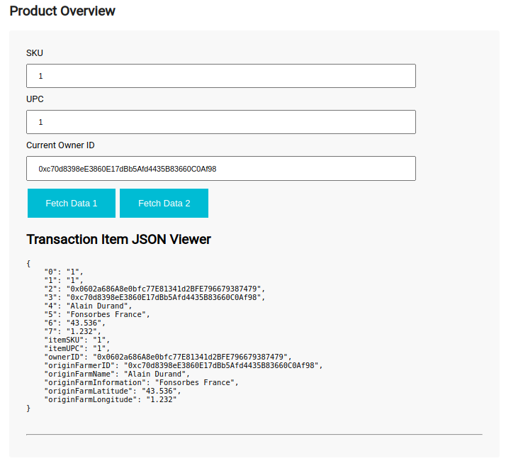
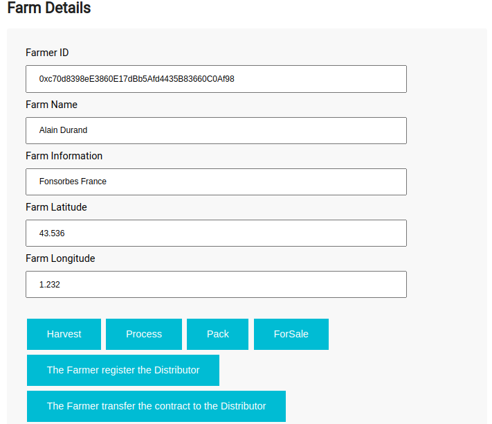
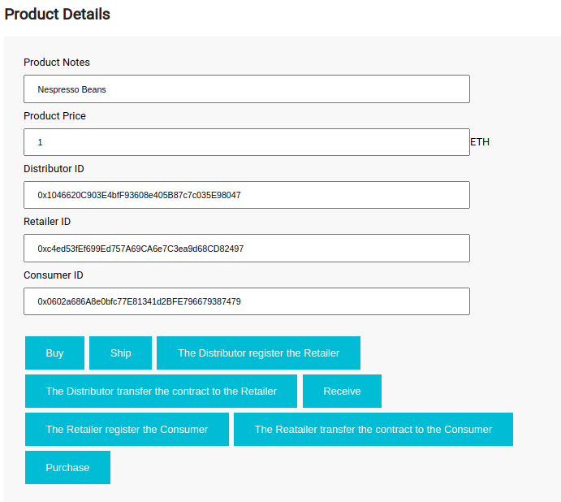
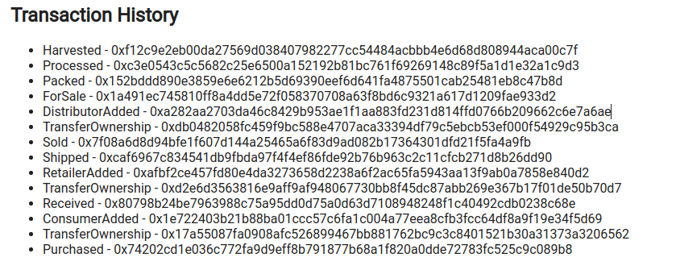
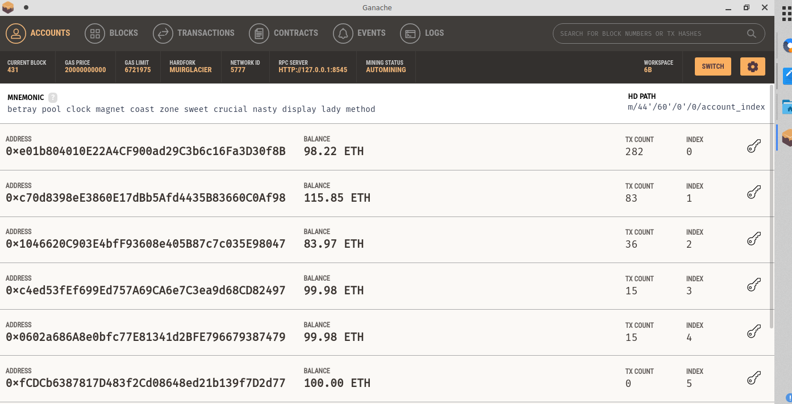
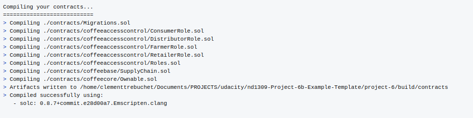
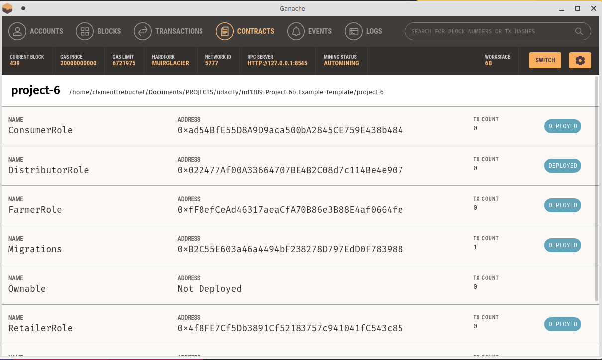
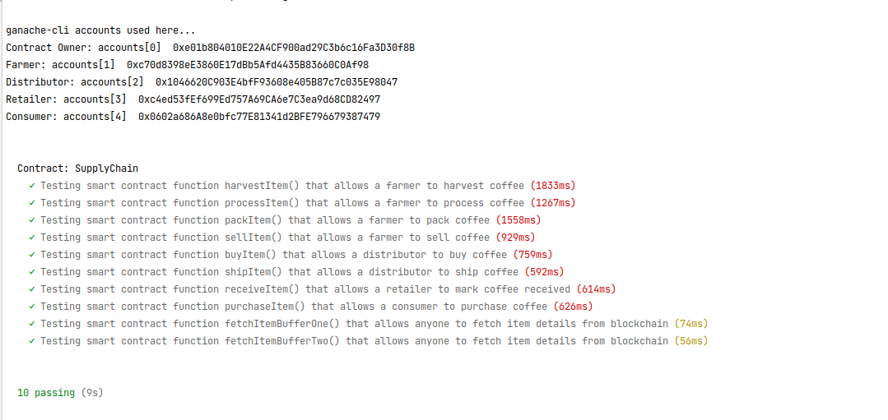

# Supply chain & data auditing

This repository contains an Ethereum DApp that demonstrates a Supply Chain flows between a Seller and Buyer.

The user story is similar to any commonly used supply chain process. 

A Seller can add items to the inventory system stored in the blockchain. 

A Buyer can purchase such items from the inventory system. 

Additionally, a Seller can mark an item as Shipped, and similarly a Buyer can mark an item as Received.

The DApp User Interface when running should look like...










## Notes
I had implemented an extra step in this project by transferring the Owner of the contract across the actors (see the note on the UI ).
You can use ganache-cli or like me the graphic version of ganache.

### Prerequisites

Please make sure you've already installed the following dependencies and enabled [MetaMask](https://metamask.io/faqs.html#:~:text=Go%20to%20MetaMask.io%20and%20select%20from%20Android%20or%20iOS%20for%20mobile%20application%20and%20select%20Chrome%20for%20desktop.%20You%20can%20also%20go%20directly%20to%20the%20Chrome%20store%2C%20Google%20Play%20store%2C%20or%20Apple%20App%20Store%20(soon).%C2%A0%C2%A0) extension in your browser.

* Ganache app: 2.5.4
* Ganache CLI v6.12.2 (ganache-core: 2.13.2)
* npm: 8.1.0
* Truffle v5.4.16 (core: 5.4.16)
* Solidity - 0.8.7 (solc-js)
* Node v16.13.0
* Web3.js v1.5.3

### Installing

> The code is written for **Solidity v0.8.7**.

A step by step series of examples that tell you have to get a development env running

Clone this repository:

```bash
git clone https://github.com/clementtrebuchet/nd1309-Project-6b
```

Change directory to ```project-6``` folder and install all requisite npm packages (as listed in ```package.json```):

```
cd project-6
npm install
```

Launch Ganache:

```bash
ganache-cli --networkId 5777 --accounts 20  --mnemonic="betray pool clock magnet coast zone sweet crucial nasty display lady method"```
```
Your terminal should look something like this:
```bash

Available Accounts
==================
(0) 0xe01b804010E22A4CF900ad29C3b6c16Fa3D30f8B (100 ETH)
(1) 0xc70d8398eE3860E17dBb5Afd4435B83660C0Af98 (100 ETH)
(2) 0x1046620C903E4bfF93608e405B87c7c035E98047 (100 ETH)
(3) 0xc4ed53fEf699Ed757A69CA6e7C3ea9d68CD82497 (100 ETH)
(4) 0x0602a686A8e0bfc77E81341d2BFE796679387479 (100 ETH)
(5) 0xfCDCb6387817D483f2Cd08648ed21b139f7D2d77 (100 ETH)
(6) 0x6AcE0B6963AA5D7510F81A367d7Ac24F966B004c (100 ETH)
(7) 0x0C1492C1E91b012Fd9d60a9eca443d1AeEC2f4a1 (100 ETH)
(8) 0x9fa8303C9680bb3554a42D1758B0F2e4b1e7eC9A (100 ETH)
(9) 0xd098307588d3e7A16076c0bB53FeC8F760e7EB49 (100 ETH)
(10) 0x9e94446F3ACBBBe6b69aE1499520975EE7Acb779 (100 ETH)
(11) 0xb8EF4DA4f4Cc43F53e6393CBcb1C39f73683eF71 (100 ETH)
(12) 0x0B933b3cf54D424A44E6946cB2E164A17576c43d (100 ETH)
(13) 0xc7BbE6B4B08e63C2082d2e0448F4cCe2B7671AD3 (100 ETH)
(14) 0xFc3fD52A70B86FD9B47C752d9710B740DCf4Ccaa (100 ETH)
(15) 0xEa33d230dFD2A9cE39fbEf2DF4841642Af368CB6 (100 ETH)
(16) 0xdd1598fb5A60B7eC2C23b29Be0DCCB3a6fec1cad (100 ETH)
(17) 0xe91B95EA41c218169C8BcFda993A4De0bEda7664 (100 ETH)
(18) 0x0A13F5e11d522b4ABfFA87Be1dC1F320282056E0 (100 ETH)
(19) 0xEb16b2D9Ace119d6dF3E8c5a9Ab2d6b13A98EC21 (100 ETH)

Private Keys
==================
(0) 0x1afad832872f1ddd482720a0424ae9967000b428adc21a5a09c070af3069f31d
(1) 0x700ccefa137b3f08ac434de0f2490bb1018986cb986c7126a5019fb593fb074f
(2) 0xf72814bfe18e7e65855f3bef77964a4580cbe4672270df679d889af52ecea3bd
(3) 0x6140d3aa1c531ec02e606fd24bd9af02ebb0da430af02a6f45631da0ead859c6
(4) 0x20a39e230dc3a7b27f9754024d5202a4db0af736285ac22329c884789d6eaf86
(5) 0xd1a415bc13d8d6041a6cbef9c1c22ec6c2688e23cd542918123bbb3eb5c6d607
(6) 0x69ab3c8a6f0fa534df82bea1e605216f176c60d76cb339dda07ae944df7bdd43
(7) 0x57196ba189babdb6d110e46355e45076f811798ec11873bffd8dc235e4d7bb50
(8) 0x53d5cdce42325896f95619ddaa146a4eb491f6078f6283ba6fad91b8a18b2c31
(9) 0x8d23c39988619b4633f7faef778ba05ac79c34e0ab403b566b4af73c618212c0
(10) 0x14d93249cc4614a9d8dfe1eaa20b02ea4965d0521ebbb4402248fca11b0af8fc
(11) 0x3b5abb16e42b5aed2c3b473bc41dc6433b21e6906078f27bff5890cc3bcdb7ec
(12) 0xb4568ece487560c71e3749a46ed43e7b1095380f355fd5d759789f1ec14d2e3f
(13) 0xa4d8d0778fdaf8d061430d7c1e39111cce02edaff5601f2ef601e69b379b749c
(14) 0x9362535bdef9e63ef075816d92c46e926febf52c16b028bea56f6dffbb91c276
(15) 0x1727bf7daf4dbb4b15cf961e3e3b3f4445167d1307059d6926bb82ec0098267f
(16) 0x6f4ececfed108e8704c20e20009db9457cca4475c361bf2a327f24ae35e02ba7
(17) 0xa51d65aee91df028c5d57618d50ad9cf666360ec78e27fed56b4c539c9e4ec4b
(18) 0x26f925cdec753fe1cb294e53f3e5ccdbe53e1e47a116ad349068d45f3877dd39
(19) 0xbc3194afd01036a8c6032072f874fbc3eb09cd1dbb56d4bcedd0c7b673b94214

HD Wallet
==================
Mnemonic:      betray pool clock magnet coast zone sweet crucial nasty display lady method
Base HD Path:  m/44'/60'/0'/0/{account_index}

Gas Price
==================
20000000000

Gas Limit
==================
6721975

Call Gas Limit
==================
9007199254740991

```
- Or if you use the Ganache graphic interface 



In a separate terminal window, Compile the smart contracts:

```
truffle compile
```

Your terminal should look something like this:



This will create the smart contract artifacts in folder ```build\contracts```.

- *Note: each time that you make a change in the contracts it's preferable to delete this folder before you recompile your contracts*

Migrate smart contracts to the locally running blockchain, ganache-cli:

```
truffle migrate
```

Your terminal should look something like this:




Test smart contracts:
```
truffle test
```

[All the 10 tests pass.](test_results.md)



In a separate terminal window, launch the DApp:

```
npm run dev
```

## Deployment on Ganache

You can find this contract deployed to Ganache [here](deploy_development.md).

## Deployment on Rinkeby

You can find these contracts deployed to Rinkeby [here](deploy_rinkeby.md) with the address of the contracts.

## UML

Four diagrams are available that makes clearer the development process

*note: these diagrams are in the svg format and could be view directly into github*

- [Activity Diagram](diagrams/activity_diagram.svg)
- [Data Model Diagram](diagrams/data_model.svg)
- [Sequence Diagram](diagrams/sequence_diagram.svg)
- [State Diagram](diagrams/state_diagram.svg)

## A note on the UI 

The Farmer will normally be the owner of the contract when you deploy it. It depends on the address you have set in the [truffle.js](project-6/truffle.js) for development section.
```bash
 development: {
            host: "127.0.0.1",
            port: 8545,
            network_id: "*",
            from: "0xc70d8398eE3860E17dBb5Afd4435B83660C0Af98", // the contract should be deployed with the address of the Farmer
            gas: 4500000,
            gasPrice: 10000000000,
        },
```
I have tested extra features in the UI like transfer the ownership of the contract across the actors.

In order to proceed to these changes I have added some buttons with an explict text on it.

If you try to bypass the expected actors that are explicitly mentioned on these buttons, the transaction will fail.

You can find below the transactions that the UI will accept.


