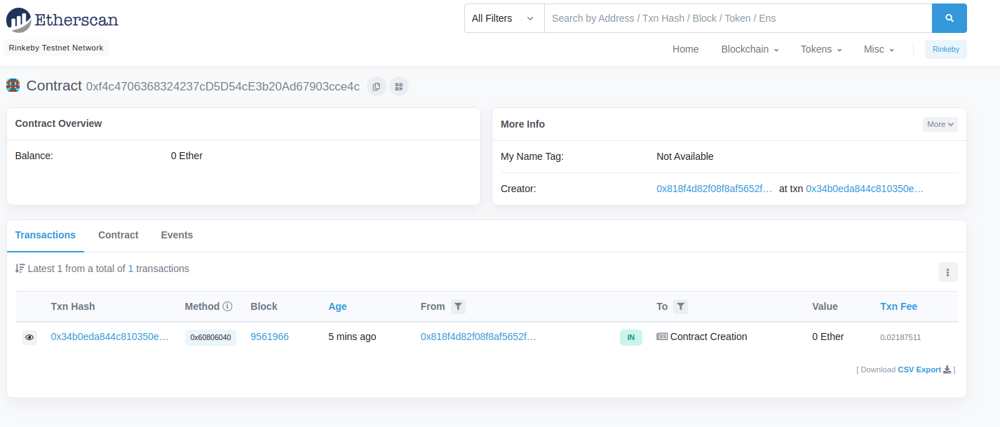
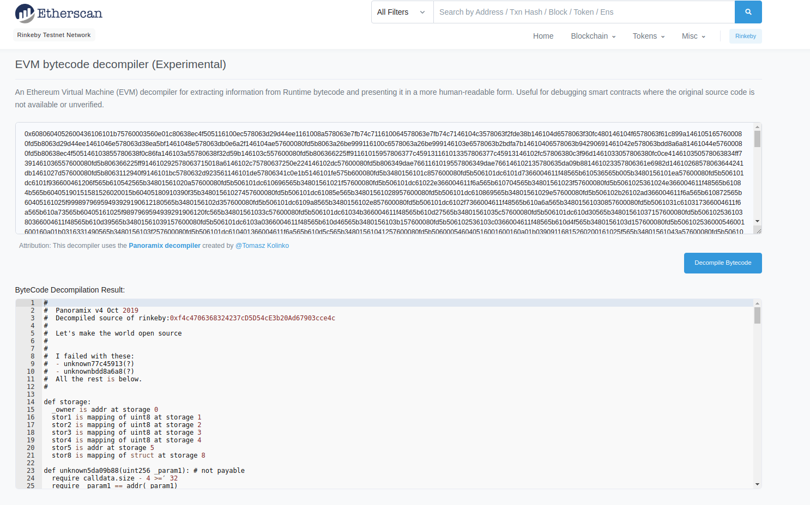

```bash
[clementtrebuchet@clemozore test]$ truffle migrate --network rinkeby

Compiling your contracts...
===========================
> Everything is up to date, there is nothing to compile.


Migrations dry-run (simulation)
===============================
> Network name:    'rinkeby-fork'
> Network id:      4
> Block gas limit: 30000000 (0x1c9c380)


2_deploy_contracts.js
=====================

   Deploying 'FarmerRole'
   ----------------------
   > block number:        9561956
   > block timestamp:     1635689678
   > account:             0x818f4d82f08f8AF5652F974fD5f04deDB91c2DF9
   > balance:             18.52585401
   > gas used:            315483 (0x4d05b)
   > gas price:           10 gwei
   > value sent:          0 ETH
   > total cost:          0.00315483 ETH


   Deploying 'DistributorRole'
   ---------------------------
   > block number:        9561957
   > block timestamp:     1635689690
   > account:             0x818f4d82f08f8AF5652F974fD5f04deDB91c2DF9
   > balance:             18.52269918
   > gas used:            315483 (0x4d05b)
   > gas price:           10 gwei
   > value sent:          0 ETH
   > total cost:          0.00315483 ETH


   Deploying 'RetailerRole'
   ------------------------
   > block number:        9561958
   > block timestamp:     1635689700
   > account:             0x818f4d82f08f8AF5652F974fD5f04deDB91c2DF9
   > balance:             18.51954435
   > gas used:            315483 (0x4d05b)
   > gas price:           10 gwei
   > value sent:          0 ETH
   > total cost:          0.00315483 ETH


   Deploying 'ConsumerRole'
   ------------------------
   > block number:        9561959
   > block timestamp:     1635689716
   > account:             0x818f4d82f08f8AF5652F974fD5f04deDB91c2DF9
   > balance:             18.51638952
   > gas used:            315483 (0x4d05b)
   > gas price:           10 gwei
   > value sent:          0 ETH
   > total cost:          0.00315483 ETH


   Deploying 'SupplyChain'
   -----------------------
   > block number:        9561960
   > block timestamp:     1635689739
   > account:             0x818f4d82f08f8AF5652F974fD5f04deDB91c2DF9
   > balance:             18.49579941
   > gas used:            2059011 (0x1f6b03)
   > gas price:           10 gwei
   > value sent:          0 ETH
   > total cost:          0.02059011 ETH


   Deploying 'Roles'
   -----------------
   > block number:        9561961
   > block timestamp:     1635689745
   > account:             0x818f4d82f08f8AF5652F974fD5f04deDB91c2DF9
   > balance:             18.49507724
   > gas used:            72217 (0x11a19)
   > gas price:           10 gwei
   > value sent:          0 ETH
   > total cost:          0.00072217 ETH


   Deploying 'Ownable'
   -------------------
   > block number:        9561962
   > block timestamp:     1635689747
   > account:             0x818f4d82f08f8AF5652F974fD5f04deDB91c2DF9
   > balance:             18.49188514
   > gas used:            319210 (0x4deea)
   > gas price:           10 gwei
   > value sent:          0 ETH
   > total cost:          0.0031921 ETH


   Deploying 'Context'
   -------------------
   > block number:        9561963
   > block timestamp:     1635689749
   > account:             0x818f4d82f08f8AF5652F974fD5f04deDB91c2DF9
   > balance:             18.49121448
   > gas used:            67066 (0x105fa)
   > gas price:           10 gwei
   > value sent:          0 ETH
   > total cost:          0.00067066 ETH

   -------------------------------------
   > Total cost:          0.03779436 ETH


Summary
=======
> Total deployments:   8
> Final cost:          0.03779436 ETH


Starting migrations...
======================
> Network name:    'rinkeby'
> Network id:      4
> Block gas limit: 30000000 (0x1c9c380)


2_deploy_contracts.js
=====================

   Deploying 'FarmerRole'
   ----------------------
   > transaction hash:    0x0f3a80dc89d5c1fe2151bb9fb6d3d7e7f2fbce44b3743fc9aa1e683925ab47b3
   > Blocks: 0            Seconds: 12
   > contract address:    0xc2571fc0BE1293A14224b9d98926aE94959f5c4A
   > block number:        9561962
   > block timestamp:     1635689769
   > account:             0x818f4d82f08f8AF5652F974fD5f04deDB91c2DF9
   > balance:             18.52569801
   > gas used:            331083 (0x50d4b)
   > gas price:           10 gwei
   > value sent:          0 ETH
   > total cost:          0.00331083 ETH


   Deploying 'DistributorRole'
   ---------------------------
   > transaction hash:    0x6ed82351939135e624de370fd702b838cf9ccfe11beb9a723d656add3d86b20a
   > Blocks: 0            Seconds: 8
   > contract address:    0x87955b88E2a4724172261f42EA3d17bF5388CB27
   > block number:        9561963
   > block timestamp:     1635689784
   > account:             0x818f4d82f08f8AF5652F974fD5f04deDB91c2DF9
   > balance:             18.52238718
   > gas used:            331083 (0x50d4b)
   > gas price:           10 gwei
   > value sent:          0 ETH
   > total cost:          0.00331083 ETH


   Deploying 'RetailerRole'
   ------------------------
   > transaction hash:    0x1fd9469a01ec35409c5eb423ccfe8b8d368ff90f4eafd2cc6ef71c4d04221071
   > Blocks: 0            Seconds: 12
   > contract address:    0x19cCfA73b1fd8231A7d4cd05bec32eEbBB7A8E4d
   > block number:        9561964
   > block timestamp:     1635689799
   > account:             0x818f4d82f08f8AF5652F974fD5f04deDB91c2DF9
   > balance:             18.51907635
   > gas used:            331083 (0x50d4b)
   > gas price:           10 gwei
   > value sent:          0 ETH
   > total cost:          0.00331083 ETH


   Deploying 'ConsumerRole'
   ------------------------
   > transaction hash:    0x56d1f70ab8a5c2bcbb1e47ce69b27e31adf58f3565ec4f60b4846ca49439ecee
   > Blocks: 1            Seconds: 12
   > contract address:    0xD591b8ED407b23170aa4c680acd99C922ff1006A
   > block number:        9561965
   > block timestamp:     1635689814
   > account:             0x818f4d82f08f8AF5652F974fD5f04deDB91c2DF9
   > balance:             18.51576552
   > gas used:            331083 (0x50d4b)
   > gas price:           10 gwei
   > value sent:          0 ETH
   > total cost:          0.00331083 ETH


   Deploying 'SupplyChain'
   -----------------------
   > transaction hash:    0x34b0eda844c810350e0b96fd223f2e964542f635702af6777a4574db491a8ff0
   > Blocks: 0            Seconds: 12
   > contract address:    0xf4c4706368324237cD5D54cE3b20Ad67903cce4c
   > block number:        9561966
   > block timestamp:     1635689829
   > account:             0x818f4d82f08f8AF5652F974fD5f04deDB91c2DF9
   > balance:             18.49389041
   > gas used:            2187511 (0x2160f7)
   > gas price:           10 gwei
   > value sent:          0 ETH
   > total cost:          0.02187511 ETH


   Deploying 'Roles'
   -----------------
   > transaction hash:    0x5c5a2865f6500d11883247c8d25326714db0b010b15588890c17f4a9d722e475
   > Blocks: 0            Seconds: 12
   > contract address:    0x8D96F9E06CCcC7Fa914B218407148d5f804bBE53
   > block number:        9561967
   > block timestamp:     1635689844
   > account:             0x818f4d82f08f8AF5652F974fD5f04deDB91c2DF9
   > balance:             18.49316824
   > gas used:            72217 (0x11a19)
   > gas price:           10 gwei
   > value sent:          0 ETH
   > total cost:          0.00072217 ETH


   Deploying 'Ownable'
   -------------------
   > transaction hash:    0x61ed377fd1f273220d4f3f00dc92c478b05692cd063c5a373b49d3655d3cd95b
   > Blocks: 0            Seconds: 8
   > contract address:    0xB9619d9719284BC6bA170795cd5c4433dc071ee8
   > block number:        9561968
   > block timestamp:     1635689859
   > account:             0x818f4d82f08f8AF5652F974fD5f04deDB91c2DF9
   > balance:             18.48981314
   > gas used:            335510 (0x51e96)
   > gas price:           10 gwei
   > value sent:          0 ETH
   > total cost:          0.0033551 ETH


   Deploying 'Context'
   -------------------
   > transaction hash:    0xdb7151e82b1c33d2f391e0805d14752a4469ea5146374a4f4ae70dc1b65ee714
   > Blocks: 0            Seconds: 12
   > contract address:    0x4C906E3623864Ab309c24e0E422CeC3B298B9E0b
   > block number:        9561969
   > block timestamp:     1635689874
   > account:             0x818f4d82f08f8AF5652F974fD5f04deDB91c2DF9
   > balance:             18.48914248
   > gas used:            67066 (0x105fa)
   > gas price:           10 gwei
   > value sent:          0 ETH
   > total cost:          0.00067066 ETH


   > Saving migration to chain.
   > Saving artifacts
   -------------------------------------
   > Total cost:          0.03986636 ETH

```

- **An example of the SupplyChain Contract deployment on the Rinkeby Testnet Network**
  * https://rinkeby.etherscan.io/address/0xf4c4706368324237cD5D54cE3b20Ad67903cce4c
  
  * https://rinkeby.etherscan.io/bytecode-decompiler?a=0xf4c4706368324237cD5D54cE3b20Ad67903cce4c
  

